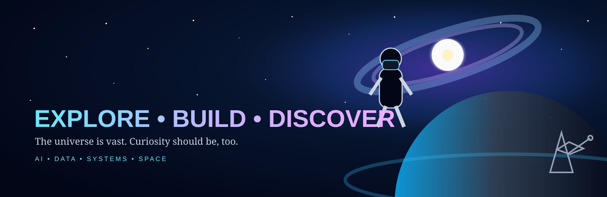

<div align="center">



# 👨‍💻 PRATIK MANURE

### `AI/ML ENGINEER` · `DATA ANALYST` · `PYTHON DEVELOPER` · `CLOUD ENGINEER`

**I build intelligent, data-driven systems — from models and agents to APIs, analytics and cloud-ready infrastructure.**

<br>

<a href="https://github.com/pratikmanure"></a>
<a href="https://linkedin.com/in/pratikmanure"></a>
<a href="mailto:pratikmanure@gmail.com"></a>

</div>

---

<details open>
<summary><h2>🧬 01 · WHO I AM</h2></summary>

<br>

<table>
<tr>
<td width="62%">

### `CURIOUS BY DEFAULT. BUILDING BY CHOICE.`

I'm a **Computer Science (AI & ML)** student focused on turning strong fundamentals into practical engineering systems.

My interests sit at the intersection of:

**Artificial Intelligence × Data × Software Engineering × Cloud**

I enjoy going beyond a model's accuracy — understanding the problem, designing the system around it, exposing it through an API, deploying it, measuring it, and improving it.

### My north star

> **Learn deeply. Build honestly. Measure everything. Keep exploring.**

</td>
<td width="38%">

### ⚡ QUICK PROFILE

**🎓 B.Tech AI & ML**  
JSPM University, Pune

**📈 CGPA**  
`8.29 / 10`

**🧠 Core**  
ML · DL · NLP · Agentic AI

**📊 Data**  
Python · SQL · Analytics

**☁️ Cloud**  
AWS · GCP · Cloud Engineering

**🌌 Beyond tech**  
Space & Astronomy

</td>
</tr>
</table>

</details>

---

<details open>
<summary><h2>🧰 02 · TECH STACK — CLICK TO EXPLORE</h2></summary>

<br>

> **Tip:** Each category is expandable. I keep this stack grouped by what I actually use, what I am strengthening, and what I am learning next.

<details open>
<summary><b>🤖 AI / MACHINE LEARNING</b></summary>

<br>


</details>

<details>
<summary><b>🐍 PYTHON & DATA</b></summary>

<br>


<br><br>


</details>

<details>
<summary><b>⚙️ ENGINEERING FUNDAMENTALS</b></summary>

<br>


<br><br>

`DSA` · `OOP` · `DBMS` · `REST APIs` · `Backend Development` · `Unit Testing` · `Git` · `GitHub`

</details>

<details>
<summary><b>☁️ CLOUD & DATA INFRASTRUCTURE</b></summary>

<br>


<br><br>


</details>

<details>
<summary><b>🚀 NEXT: CLOUD ENGINEERING</b></summary>

<br>

**Learning roadmap**

`Linux` → `Networking` → `AWS/GCP` → `Docker` → `CI/CD` → `Terraform` → `Kubernetes` → `System Design` → `Distributed Systems`

</details>

</details>

---

<details open>
<summary><h2>🛡️ 03 · CURRENT FLAGSHIP — ARGUS DEFENSE CORE</h2></summary>

<br>

<div align="center">

### **ARGUS Defense Core (ADC)**
#### *A Hierarchical AI-Orchestrated Multi-Agent Cyber Defense Framework*

`DETECT` → `ANALYZE` → `EXPLAIN` → `PLAN` → `RESPOND` → `RECOVER`

</div>

ARGUS is my current final-year research project: an AI orchestration layer designed to coordinate specialized security agents for intelligent, explainable and increasingly autonomous threat detection and response.

```text
                    ┌─────────────────────────┐
                    │    ARGUS ORCHESTRATOR   │
                    └────────────┬────────────┘
                                 │
             ┌───────────────────┼───────────────────┐
             ▼                   ▼                   ▼
       ┌───────────┐       ┌──────────────┐   ┌─────────────┐
       │ SENTINEL  │       │   MALWARE    │   │   NETWORK   │
       │   AGENT   │       │    HUNTER    │   │    AGENT    │
       └─────┬─────┘       └──────┬───────┘   └──────┬──────┘
             └────────────────────┼──────────────────┘
                                  ▼
                       ┌─────────────────────┐
                       │ EXPLAINABILITY      │
                       │      ENGINE         │
                       └──────────┬──────────┘
                                  ▼
                       ┌─────────────────────┐
                       │ DEFENSIVE PLANNER   │
                       │       / LLM         │
                       └──────────┬──────────┘
                                  ▼
                       ┌─────────────────────┐
                       │ RESPONSE & RECOVERY │
                       │        AGENT        │
                       └─────────────────────┘
```

| Layer | Direction |
|---|---|
| 🧠 AI | ML · DL · NLP · LLMs · Agentic AI · Explainability |
| 🐍 Backend | Python · FastAPI · APIs |
| 🕸️ Knowledge | Neo4j · threat relationships |
| 🖥️ Frontend | React · security dashboard |
| 🗄️ Data | SQLite · PostgreSQL |
| 🐳 Deployment | Docker · AWS · GCP · MLOps |
| 🛡️ Intelligence | MITRE ATT&CK · VirusTotal · VirusShare |
| 🧪 Research datasets | CICIDS2017 · UNSW-NB15 · NSL-KDD |

<a href="https://github.com/pratikmanure"></a>

</details>

---

<details open>
<summary><h2>🏆 04 · SELECTED ENGINEERING WORK</h2></summary>

<br>

<table>
<tr>
<td width="50%">

### 🏢 Deloitte
**AI / Data Engineering**

A public repository showcasing practical AI/data engineering work, problem solving and analytics.

`Python` `SQL` `ETL` `Analytics` `ML`

<br>

**→ Public repository**

</td>
<td width="50%">

### 🧠 FraudStream Command Center
**Real-Time Fraud Intelligence**

A public repository for fraud detection, risk scoring, alerts, monitoring and an interactive command center.

`Python` `ML` `FastAPI` `React` `PostgreSQL`

<br>

**→ Public repository**

</td>
</tr>
<tr>
<td width="50%">

### 🛡️ ARGUS Defense Core
**Multi-Agent Cyber Defense**

My current flagship research project.

`Python` `LLMs` `Agentic AI` `FastAPI` `Neo4j` `React`

<br>

**→ Public repository**

</td>
<td width="50%">

### 📈 Algorithmic Trading Systems
**Quantitative Trading Infrastructure**

A private project covering strategy research, backtesting, risk management, signal generation and performance analytics.

`Python` `Pandas` `Backtesting` `APIs` `Risk`

<br>

**🔒 Private implementation**

</td>
</tr>
</table>

> **Note:** The first three projects are public repositories. Only the Algorithmic Trading implementation is private.

</details>

---

<details>
<summary><h2>🎓 05 · EDUCATION & ACADEMICS</h2></summary>

<br>

### B.Tech — Computer Science (Artificial Intelligence & Machine Learning)
**JSPM University, Pune · 2023–2027**

<div align="center">

### `8.29 / 10.00`
**Current CGPA · after Semester VI**

</div>

**Selected academic strengths**

`Data Structures — O` · `AI & ML — A+` · `NLP — A+` · `Data Mining — A+`  
`Pattern Recognition & Anomaly Detection — A` · `DBMS — A` · `Computer Networks — A`  
`Deep Learning & Neural Networks — O`

### School

**HSC — Science:** `73.83%`  
**SSC — CBSE:** `94%`

</details>

---

<details>
<summary><h2>🏅 06 · CERTIFICATIONS — CREDIBILITY OVER QUANTITY</h2></summary>

<br>

I will only display credentials that I have **actually completed and can verify**.

### Priority roadmap

| Platform | Credential direction | Relevance |
|---|---|---|
| IBM SkillsBuild | AI Fundamentals | 🤖 AI foundations |
| IBM SkillsBuild | Data Fundamentals | 📊 Data + analytics |
| Databricks | Fundamentals Accreditation | 🧱 Data / AI infrastructure |
| AWS Skill Builder | Cloud foundations / training badges | ☁️ Cloud |
| Google Cloud Skills Boost | Data Analytics / BigQuery badges | 📊☁️ Data + cloud |
| Microsoft Learn | AI / Azure fundamentals | 🤖☁️ AI + cloud |

</details>

---

<details>
<summary><h2>🗺️ 07 · MY LEARNING ROADMAP</h2></summary>

<br>

```text
                         CURRENT
                            │
             ┌──────────────┼──────────────┐
             ▼              ▼              ▼
          AI / ML         DATA        ENGINEERING
             │              │              │
          ML / DL          SQL          DSA / OOP
          NLP              BI           DBMS / APIs
          Agents           Analytics    Backend
             │              │              │
             └──────────────┼──────────────┘
                            ▼
                       DEPLOYMENT
                            │
                 Docker → AWS → GCP
                            │
                            ▼
                         MLOps
                            │
                            ▼
                   CLOUD ENGINEERING
                            │
             Terraform → Kubernetes
                            │
                            ▼
                SYSTEMS / DISTRIBUTED AI
```

### 🎯 Long-term direction

**AI/ML Engineer + Cloud Engineering**

I want to become someone who can move from:

**problem → data → model → agent → API → infrastructure → deployment → monitoring**

</details>

---

<details>
<summary><h2>🧠 08 · ENGINEERING PRINCIPLES</h2></summary>

<br>

> **Don't just train the model. Understand the problem. Build the system. Measure the result. Deploy it. Learn from failure.**

```text
PROBLEM
   ↓
DATA
   ↓
UNDERSTANDING
   ↓
MODEL / AGENT
   ↓
EVALUATION
   ↓
SYSTEM
   ↓
DEPLOYMENT
   ↓
MONITORING
   ↓
ITERATION
```

</details>

---

<details open>
<summary><h2>🌌 09 · BEYOND CODE</h2></summary>

<br>

Space and astronomy have always fascinated me.

The universe is a reminder that **curiosity has no upper bound**.

> *“Somewhere, something incredible is waiting to be known.”*  
> — **Carl Sagan**

That is the mindset I bring to engineering too:

**Explore what is unknown. Understand what is complex. Build what is useful.**

</details>

---

<div align="center">

## 🌠 BUILDING IN PUBLIC. LEARNING WITHOUT A CEILING.

### **AI · DATA · SYSTEMS · CLOUD · CURIOSITY**

<br>

<a href="https://github.com/pratikmanure">

</a>
<a href="https://linkedin.com/in/pratikmanure">

</a>

<br><br>

`Made with curiosity • Built with Python • Inspired by the universe`

</div>
